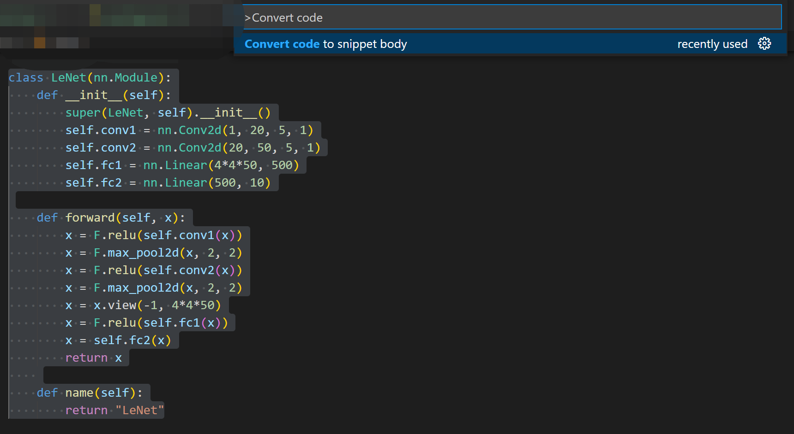

# code2snippet README

A vscode extension for converting selected code to snippet body format.

## Usages

To convert:

- Select the corresponding code
- Press CTRL + SHIFT + P
- Select "Convert code to snippet body"
- Done!

## Features

Snippets in VScode is very useful, you can also create your own snippets. The thing is that you'll need to reformat
your code by adding a lot of `"` and `\`, which is boring and time consuming.

With **code2snippet**, you can convert any code to snippet body format with a single command.

To convert below code to snippet,


Just select the code, open command palette `ctrl+shift+p`, type `convert code to snippet body`,



Then copy and paste the converted code to your snippet file.

*in file 'Code/User/snippets/python.json'*

```json
{
    "Pytorch LeNet": {
        "prefix": "pt.lenet",
        "body": [
            "class LeNet(nn.Module):",
            "    def __init__(self):",
            "        super(LeNet, self).__init__()",
            "        self.conv1 = nn.Conv2d(1, 20, 5, 1)",
            "        self.conv2 = nn.Conv2d(20, 50, 5, 1)",
            "        self.fc1 = nn.Linear(4*4*50, 500)",
            "        self.fc2 = nn.Linear(500, 10)",
        
            "    def forward(self, x):",
            "        x = F.relu(self.conv1(x))",
            "        x = F.max_pool2d(x, 2, 2)",
            "        x = F.relu(self.conv2(x))",
            "        x = F.max_pool2d(x, 2, 2)",
            "        x = x.view(-1, 4*4*50)",
            "        x = F.relu(self.fc1(x))",
            "        x = self.fc2(x)",
            "        return x",
            "    ",
            "    def name(self):",
            "        return \"LeNet\"",
        ],
        "description": "Create a LeNet with PyTorch."
    }
}
```

Use the snippet like below:


## Release Notes

### 0.1.0

Initial release of code2snippet.

**Enjoy!**
